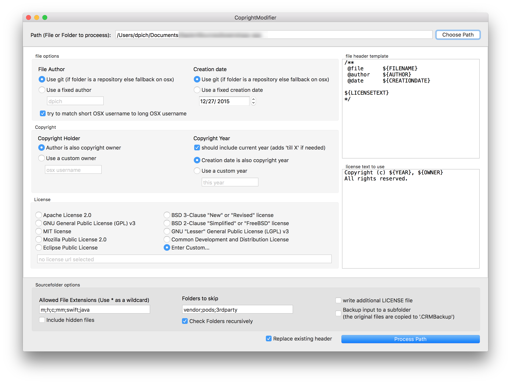
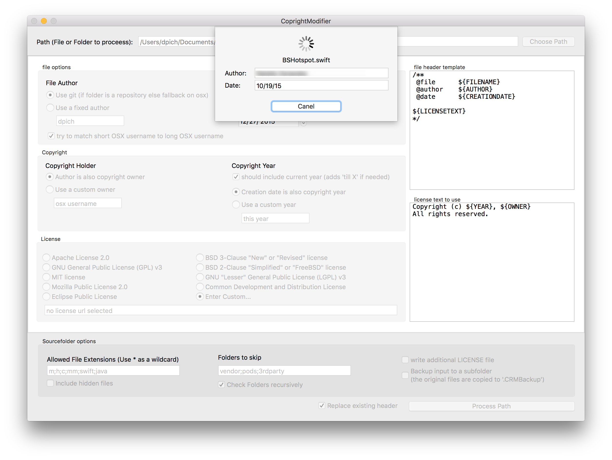
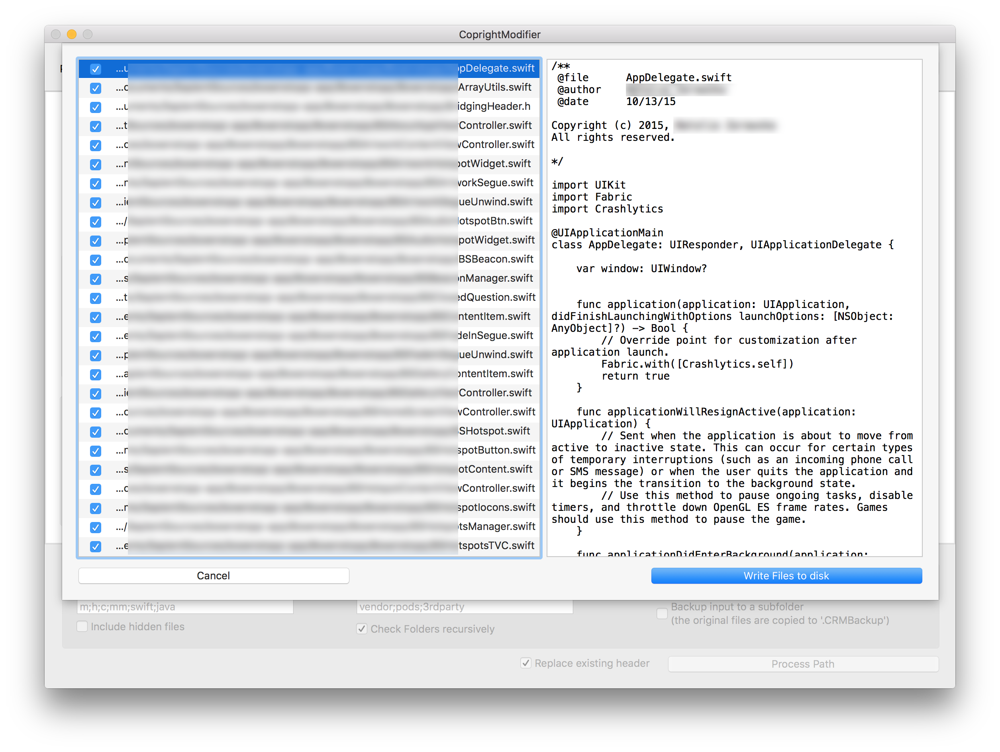

CoprightModifier
================

modify the copyright HEADER of source files (.h, .m, .swift, .java ... whatever)

howto:
====

1. choose the folder with the files (BEST a folder containing a git repository)

2. IF you want a backup of the whole folder before any modification is done, check the corresponding checkbox. It is off by default as most users will use either git or any other VCS and dont need a backup then.

3. choose any or none of the options to modify the generation of the new copyright header
	- e.g. choose how to determine the initial author and creation date of a file
	- e.g. choose an open source license to confirm to (or not - depends on your needs)
	- choose which file types to process and what subfolders to skip
	- e.g. ...
	
4. optionally fine tune the generated templates

	

5. process the folder(s). (For git repos, depending on the amount of files and the no. of git commits this can take a while)

	

6. REVIEW the changes that would be made to the files that match and confirm or reject them on a per-file basis and 'save' the changes to disk

	